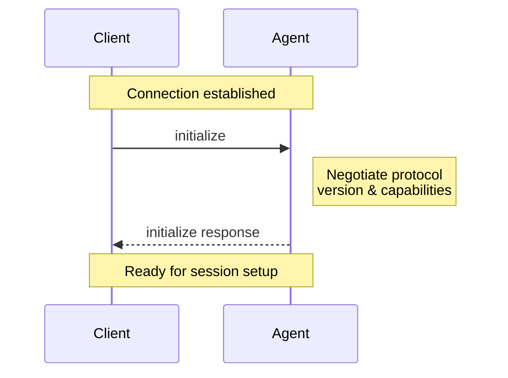

{/* todo! link to all concepts */}

The Initialization phase allows [Clients](./overview#client) and [Agents](./overview#agent) to negotiate protocol versions, capabilities, and authentication methods.

<br />



<br />

Before a Session can be created, Clients **MUST** initialize the connection by calling the `initialize` method with:

- The latest [protocol version](#protocol-version) supported
- The [capabilities](#client-capabilities) supported

```json
{
  "jsonrpc": "2.0",
  "id": 0,
  "method": "initialize",
  "params": {
    "protocolVersion": 1,
    "clientCapabilities": {
      "fs": {
        "readTextFile": true,
        "writeTextFile": true
      }
    }
  }
}
```

The Agent **MUST** respond with the chosen [protocol version](#protocol-version) and the [capabilities](#agent-capabilities) it supports:

```json
{
  "jsonrpc": "2.0",
  "id": 0,
  "result": {
    "protocolVersion": 1,
    "agentCapabilities": {
      "loadSession": true,
      "promptCapabilities": {
        "image": true,
        "audio": true,
        "embeddedContext": true
      }
    },
    "authMethods": []
  }
}
```

## Protocol version

The protocol versions that appear in the `initialize` requests and responses are a single integer that identifies a **MAJOR** protocol version. This version is only incremented when breaking changes are introduced.

Clients and Agents **MUST** agree on a protocol version and act according to its specification.

See [Capabilities](#capabilities) to learn how non-breaking features are introduced.

### Version Negotiation

The `initialize` request **MUST** include the latest protocol version the Client supports.

If the Agent supports the requested version, it **MUST** respond with the same version. Otherwise, the Agent **MUST** respond with the latest version it supports.

If the Client does not support the version specified by the Agent in the `initialize` response, the Client **SHOULD** close the connection and inform the user about it.

## Capabilities

Capabilities describe features supported by the Client and the Agent.

All capabilities included in the `initialize` request are **OPTIONAL**. Clients and Agents **SHOULD** support all possible combinations of their peer's capabilities.

The introduction of new capabilities is not considered a breaking change. Therefore, Clients and Agents **MUST** treat all capabilities omitted in the `initialize` request as **UNSUPPORTED**.

Capabilities are high-level and are not attached to a specific base protocol concept.

Capabilities may specify the availability of protocol methods, notifications, or a subset of their parameters. They may also signal behaviors of the Agent or Client implementation.

### Client Capabilities

The Client **SHOULD** specify whether it supports the following capability:

#### File System

The Client **MAY** expose its [File System](./file-system) abstraction to varying degrees:

<ParamField path="readTextFile" type="boolean">
  The `fs/read_text_file` method is available.
</ParamField>

<ParamField path="writeTextFile" type="boolean">
  The `fs/write_text_file` method is available.
</ParamField>

### Agent Capabilities

The Agent **SHOULD** specify whether it supports the following capabilities:

<ResponseField name="loadSession" type="boolean" post={["default: false"]}>
  The [`session/load`](./session-setup#loading-sessions) method is available.
</ResponseField>

<ResponseField name="rewindSession" type="boolean" post={["default: false"]}>
  The `session/rewind` method is available.
</ResponseField>

<ResponseField name="promptCapabilities" type="PromptCapabilities Object">
  Object indicating the different types of [content](./content) that may be
  included in `session/prompt` requests.
</ResponseField>

#### Prompt capabilities

As a baseline, all Agents **MUST** support `ContentBlock::Text` and `ContentBlock::ResourceLink` in `session/prompt` requests.

Optionally, they **MAY** support richer types of [content](./content) by specifying the following capabilities:

<ResponseField name="image" type="boolean" post={["default: false"]}>
  The prompt may include `ContentBlock::Image`
</ResponseField>

<ResponseField name="audio" type="boolean" post={["default: false"]}>
  The prompt may include `ContentBlock::Audio`
</ResponseField>

<ResponseField name="embeddedContext" type="boolean" post={["default: false"]}>
  The prompt may include `ContentBlock::Resource`
</ResponseField>

---

Once the connection is initialized, you're ready to [create a session](./session-setup) and begin the conversation with the Agent.
